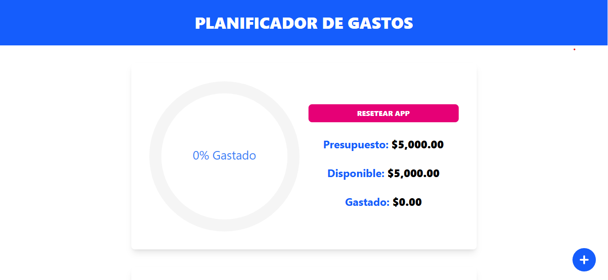
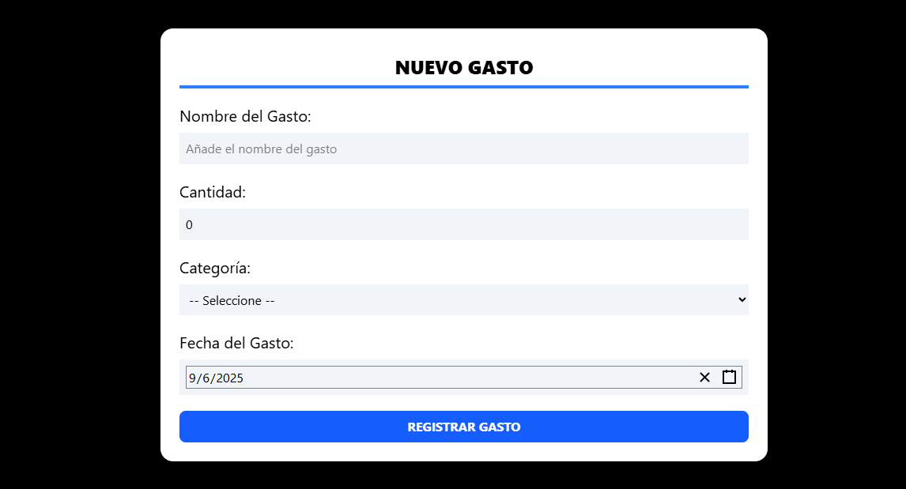
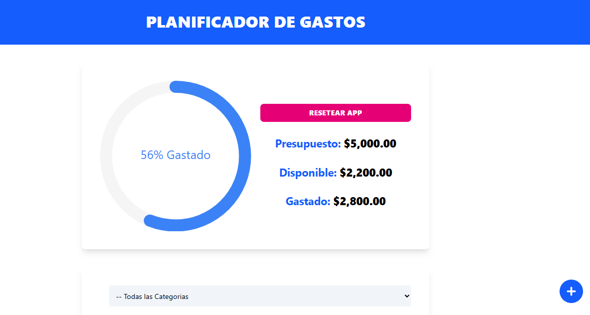
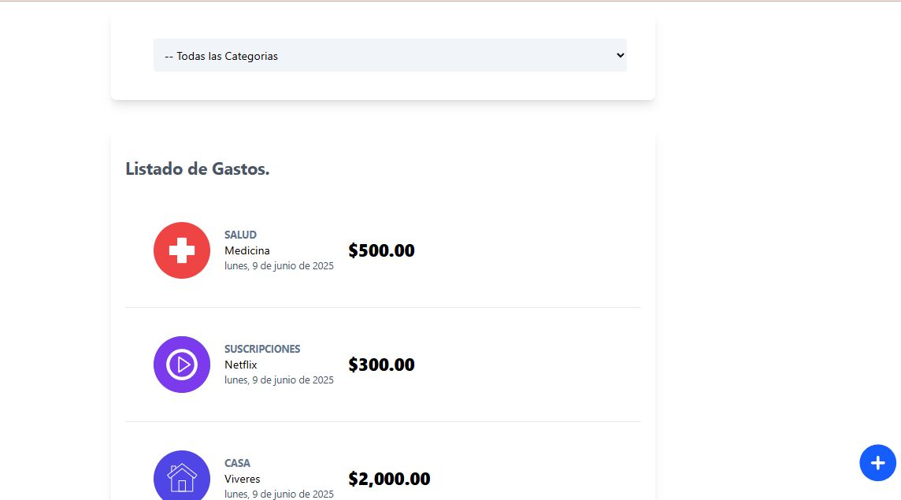

# 💰 Expense & Budget Tracker – Context API

A web application to manage your personal budget and expenses, built with **React**, **TypeScript**, **Vite**, and **Tailwind CSS**. It uses the **Context API** with `useReducer` for global state management without external libraries. Easily add, edit, delete, and filter expenses through an intuitive interface.

## ✨ Features

- 🎯 **Custom Budget**: Set and update your monthly budget.
- 📝 **Expense Logging**: Add expenses with name, amount, category (e.g. food, transport), and date.
- ✏️ **Edit Expenses**: Modify any existing expense from a modal.
- 🗑️ **Delete Expenses**: Swipe or tap to remove them from the list.
- 📅 **Filter by Category**: View only the expenses that match the selected category.
- 🔄 **Reset App**: Button to clear budget and expenses, including `localStorage`.
- 📅 **Date Picker**: Select the expense date with `react-date-picker`.
- 📊 **Visual Progress Indicator**: Circular progress bar (`react-circular-progressbar`) shows how much of your budget has been spent.

## 🚀 Technologies Used

- ⚛️ **React** – Declarative UI and reusable components.
- 🧑‍💻 **TypeScript** – Strongly typed JavaScript for safer code.
- ⚡ **Vite** – Fast and modern build tool.
- 🎨 **Tailwind CSS** – Utility-first CSS for responsive, clean design.
- 🧩 **Context API + useReducer** – Centralized state management without Redux.
- 📅 `react-date-picker` – Simple and effective date selector.
- 📈 `react-circular-progressbar` – Circular visualization for budget tracking.

## 🖼️ Screenshots

### 🏁 App Home – Initial Budget Input

### ➕ Add Expense Modal

### 📊 Budget Tracker with Circular Progress

### 🧾 Expense List and Category Filter

> 💡 Make sure the screenshots are saved under `public/screenshots/` in your project folder.

## 📦 Installation

To run the project locally, follow these steps:

# 1. Clone the repository
git clone https://github.com/Angel8118/control-gastos-contextapi.git
cd control-gastos-contextapi

# 2. Install dependencies
npm install

# 3. Start the development server
npm run dev

# 4. Open your browser at:
http://localhost:5173

🧠 What I Learned
Throughout the development of this project, I strengthened and applied the following skills:

Managing global state using Context API and useReducer in TypeScript.

Defining strongly-typed action types and reducers.

Using localStorage for persistent data and implementing a clean app reset.

Creating modern and responsive UI with Tailwind CSS.

Integrating useful libraries like react-date-picker and react-circular-progressbar.

Handling form inputs, validation, and dynamic filters.

## ✨ Click here to open the project in your browser:
https://grand-torrone-bfda7f.netlify.app/

🤝 Contributions
Contributions are welcome! If you have suggestions or want to improve the app, feel free to open an issue or submit a pull request.

📄 License
This project is licensed under the MIT License. See the LICENSE file for more information.
